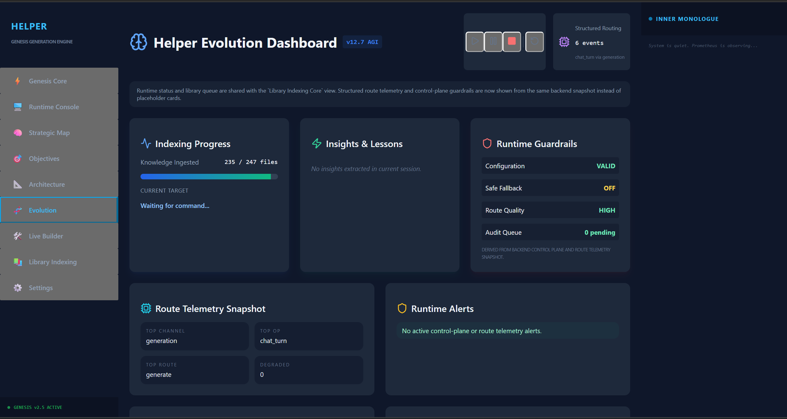
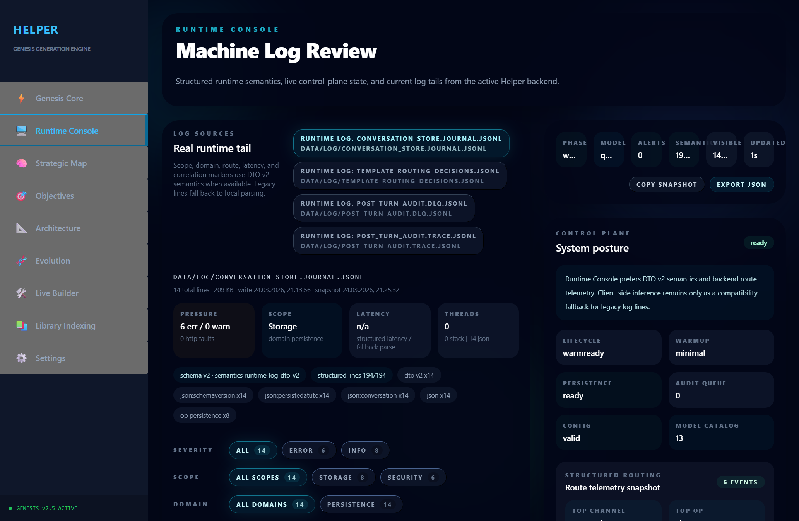
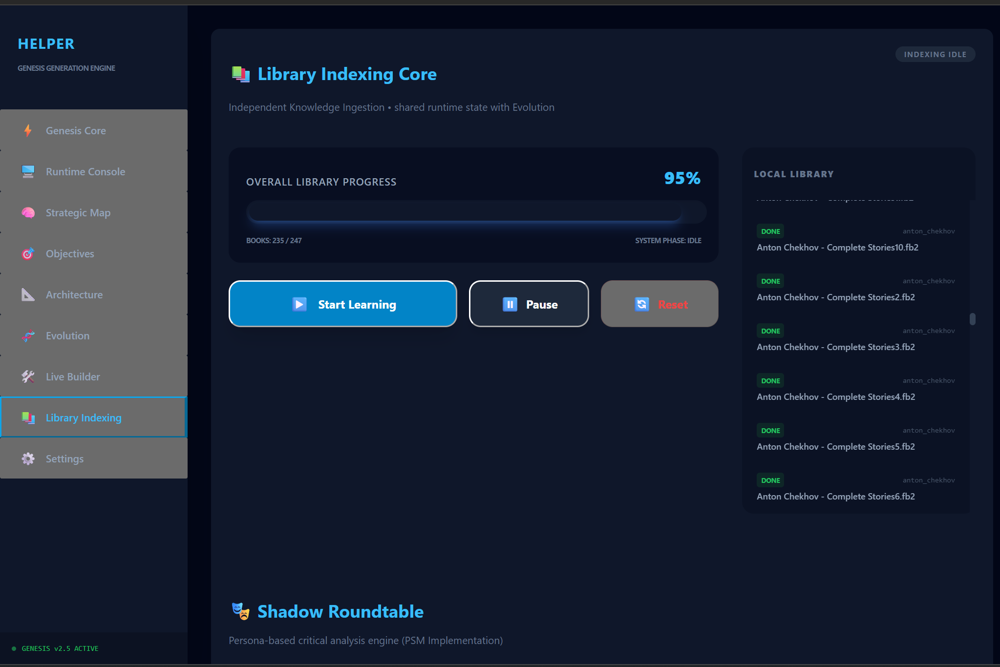
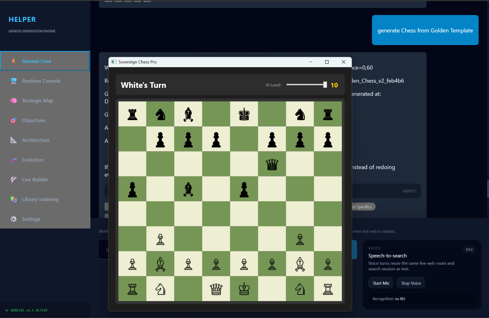
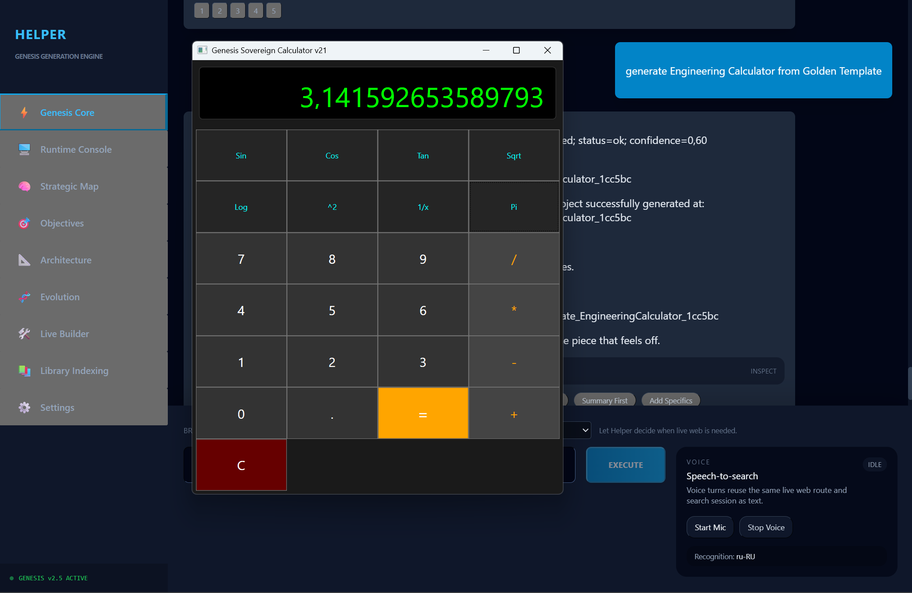

# HELPER

HELPER is a local-first operator shell for research, planning, generation, and runtime-guided execution.

This repository is a curated public showcase. It is not the full private-core repository and it is not a standalone runnable distribution.

## Honest Status

- Release baseline: `PASS`
- Current certification state: `GREEN_ANCHOR_PENDING`
- Human-level parity: `not proven`
- Blind human evaluation: `implemented, but the current corpus is still non-authoritative`
- `14-day` parity window: `not started`

This public repository intentionally excludes the private-core certification bundle, parity evidence bundle, internal scripts, and operator-only artifacts. Do not claim `human-level parity achieved` from this repository.
Public meanings for the status terms above live in [Status definitions](docs/status-definitions.md).

## What This Showcase Covers

- Real UI surfaces from a local HELPER session
- Real generated desktop project artifacts
- A public-safe runnable runtime review slice
- Public-facing product docs and contact surfaces
- Public issue templates for demo requests and reviewer intake
- A public-safe boundary between showcase material and private core implementation

## Public Reading Order

- [Docs hub](docs/README.md)
- [One-pager](docs/one-pager.md)
- [Executive summary](docs/executive-summary.md)
- [Status definitions](docs/status-definitions.md)
- [Product overview](docs/product-overview.md)
- [Architecture overview](docs/architecture-overview.md)
- [Demo guide](docs/demo-guide.md)
- [Runtime review slice](runtime-review-slice/README.md)
- [Risk disclosure](docs/risk-disclosure.md)
- [IP and ownership](docs/ip-and-ownership.md)
- [Due diligence readiness](docs/due-diligence-readiness.md)
- [Public proof boundary](docs/public-proof-boundary.md)
- [Roadmap](docs/product-roadmap.md)

## Screenshots

### Evolution Dashboard

Live runtime summary showing indexing progress, structured route telemetry, runtime guardrails, and alert state from a local session.

### Runtime Console

Machine log review with log source selection, runtime pressure summary, severity filters, and control-plane posture.

### Library Indexing

Knowledge-ingestion progress and queue control for the local library pipeline.

### Generated Chess App

Desktop chess application generated by HELPER from a Golden Template workflow during a local demo run.

### Generated Engineering Calculator

Desktop engineering calculator generated as a separate project artifact to demonstrate multi-project generation capability.

## Media And Decks

- [Media pack notes](media/README.md)
- [Architecture diagram](media/helper-architecture-overview.svg)
- [Public hero banner](media/helper-hero-banner.svg)
- [Demo preview GIF](media/demo-preview.gif)
- [Runnable runtime review slice](runtime-review-slice/README.md)
- [Product deck](deck/product-deck.pdf)
- [Investor deck](deck/investor-deck.pdf)

## Public Trust Files

- [Contact](CONTACT.md)
- [Security](SECURITY.md)
- [Contributing](CONTRIBUTING.md)
- [Code of conduct](CODE_OF_CONDUCT.md)
- [FAQ](FAQ.md)
- `LICENSE`

## Publication Boundary

- This repository is the sanitized showcase pack, not the private-core repo.
- Some internal evidence and certification materials are intentionally excluded.
- Screenshots and generated artifacts are presented as captured local demo evidence from HELPER sessions.
- The runnable runtime review slice demonstrates a narrow public-safe proof surface, not the full private-core product.
- For proof limits and reproducibility boundaries, see [Public proof boundary](docs/public-proof-boundary.md).
- Public claims must stay aligned with the current honest status above.

## For Investors, Partners, And Potential Acquirers

Use this repository to understand product shape, status, and trust boundary. For serious conversations, start with the docs hub, the deck files, and [CONTACT.md](CONTACT.md).

## Contact

Commercial, partnership, and demo intent should go through [CONTACT.md](CONTACT.md). Sensitive vulnerability reporting should follow [SECURITY.md](SECURITY.md).
