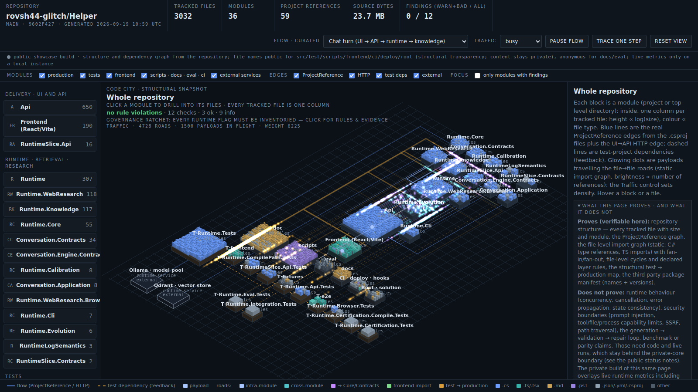

# HELPER

**[Open the interactive topology →](https://rovsh44-glitch.github.io/Helper/topology/)** — an isometric map of the whole HELPER codebase: every module (16 .NET projects, React UI, tests, scripts, docs, eval) as a block, every tracked file as a column (height = size, colour = type), the real `ProjectReference` graph between projects, and animated payload flows along the real chains (chat turn → API → runtime → knowledge, local retrieval, web research, ingest, eval harness). Click a module to drill down. File names are intentionally hidden in this public build (private-core boundary); the same page inside a running HELPER instance overlays live metrics (requests, turn stages, retrieval, model pool, persistence).

HELPER public repository is a curated showcase surface for the product, not the private engineering core.

## What This Repository Is

This repository exists to provide a public-facing view of:

- product positioning
- architecture and use-case narratives
- trust and contact documents
- issue intake forms
- links to sanitized proof surfaces

## What This Repository Is Not

This repository intentionally does **not** contain the full code-bearing core:

- no full `src/`
- no full `test/`
- no operator `scripts/`
- no eval corpora or live runtime artifacts

Implementation, internal tooling, and engineering history remain outside the public default branch.

## Public-Facing Pack

Start here:

- [One-pager](docs/one-pager.md)
- [Product overview](docs/product-overview.md)
- [Architecture overview](docs/architecture-overview.md)
- [Use cases](docs/use-cases.md)
- [Repository scope](docs/repository-scope.md)
- [Public release checklist](docs/public-release-checklist.md)
- [Release notes 2026-08-19](docs/release-notes-2026-08-19.md)
- [Public status 2026-08-19](docs/public/HELPER_PUBLIC_STATUS_2026-08-19.md)
- [Release notes 2026-04-18](docs/release-notes-2026-04-18.md)

Trust and contact:

- [Contact](CONTACT.md)
- [Security](SECURITY.md)
- [FAQ](FAQ.md)
- [Contributing](CONTRIBUTING.md)

## Public Proof Surface

Sanitized public proof bundles are published separately from this showcase repository.

Current public proof repo:

- `https://github.com/rovsh44-glitch/helper-web-reliability-50-proof`

This split is deliberate:

- this repo is the product-facing showcase
- the proof repo is the evidence-facing export
- the private core repo remains the implementation source of truth

## Honest Status

- release baseline: `PASS`
- parity claim: `not proven`
- blind human evaluation: `not complete`
- counted long-window parity: `not complete`

Public claims from this repository should stay within those limits unless a separately published proof bundle demonstrates more.

## Repository Model

The intended topology is:

1. private core repo for implementation
2. public showcase repo for narrative and intake
3. separate public proof repos for sanitized evidence bundles

This repository is only lane `2`.
